# EChem Plotter
<!-- TABLE OF CONTENTS -->
#### Table of Contents
  <ol>
    <li><a href="#introduction">Introduction</a></li>
    <li><a href="#license">License</a></li>
    <li><a href="#installation">Installation</a></li>
    <li><a href="#instruction">Instruction</a>
      <ul>
        <li><a href="#quick-start">Quick Start</a></li>
        <li><a href="#batch-processing">Batch Processing</a></li>
      </ul>
    </li>
  </ol>

<!-- ABOUT THE PROJECT -->
## Introduction
In scientific research, experiments can be highly repetitive, as are their data. EChem Plotter is software designed to ease the plotting of experimental data that have identical format and process procedure. With this software, you can program without coding knowledge and use your template to process all the similar data.

The software is based on python and its modules including pyQt5, matplotlib, numpy, and pandas.

The software includes some templates designed for data generated by the EC-Lab Battery Station. These templates can easily plot CV, CA, CP, Cycle, and EIS, which are very common electrochemistry experiments. The templates are a good starting point and can be easily extended to fit other needs. You can also start from scratch and make your own template.

#### Images plotted by these templates:

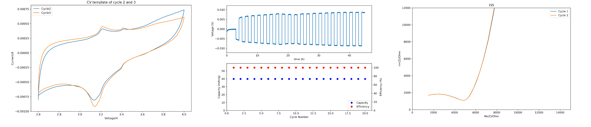

## License

all rights reserved. Redistribution of edited versions and commercial use is prohibited unless expressly permitted by the author.

## installation

Option 1: Executable file. download the [zip](./EChemPlotter_v1.0.zip) file and unzip, no installation is needed. Excecute the EChem_Plotter.exe and you are ready to go.

Option 2: If you have python installed, download the source code and run EChemPlotter.py. The source code requires python 3.5 or higher versions. Make sure you have PyQt5, Numpy, Pandas, and Matplotlib modules installed.

## Instruction

If you use the executable file EChem_Plotter.exe, you will first see a black window, which is the console, please wait for the main window to pop up:

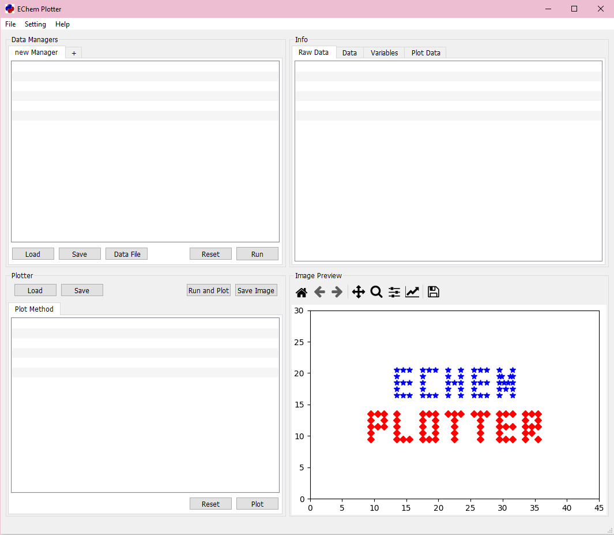

The UI is composed of 4 parts:

- The left top part is data Manager Tab, where you control how to process your data.

- The right top part is data Info Window, where you can view your data.

- The left bottom part is plotter, where you control what to plot.

- The right bottom part is image preview, where you can preview and make adjustment to the image.

### Quick Start
There are some provided templates for you to start with. A template contains data methods and plot method, and can process certain data types in one click.
First, go to menu and select 'Load Template':

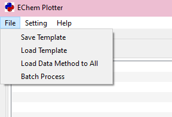

A select file dialog will pop up and you will see a 'DemoDataAndTemplate' folder, go to DemoDataAndTemplate\Basic\ and select Base_Template.tmp.

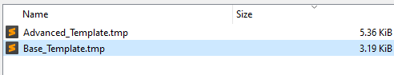

This template is designed for the linear.txt, or any data that has 'x', 'y' as header. Lets' click on the 'Data File' button in the Data Managers part.

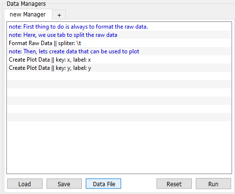

Then, select linear.txt, the linear txt data will show up on the info window:

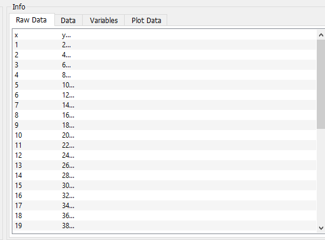

If you wonder what the program does, you can double click on the list items and a dialog will show up, let's click on the 'Format Raw Data' row:

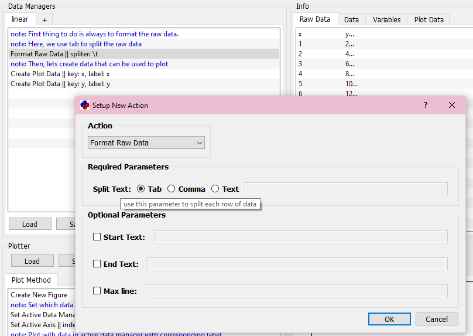

You can see that we are spliting the raw data with tab. Hover on the parameter text will show you description of the parameter.
You can edit the action and parameters to do different things, but for now let's just close the dialog and click 'run and plot' in the plotter part.

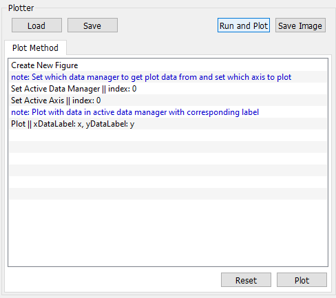

And that's it, the plot is there and you can click 'save image' to save it!
You can use the tool bar above image preview to adjust the image, you can also go to menu->setting->image format to change the size and dpi of the image.
To verify that the data are correctly processed, you can click on the Data/Variable/Plot Data tabs in the info part. Note that only plot data is used for plotting.

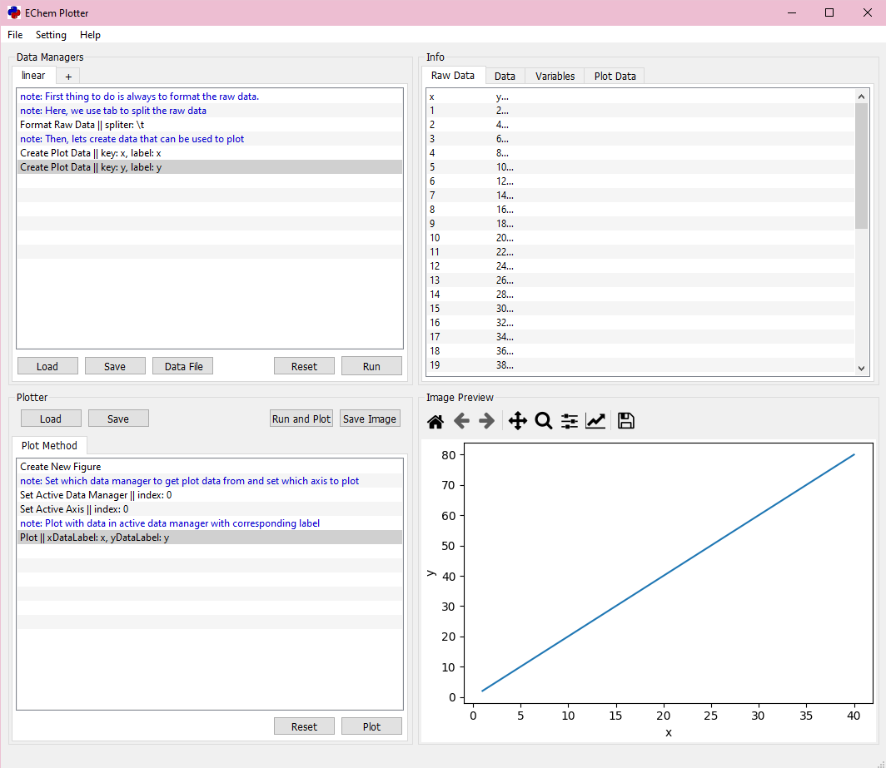

Feel free to play with the program. You can try other templates and data file, edit parameters, and plot methods. If you don't understand what a button/parameter does, hover on it and a help text may show up!

### Batch Processing

A great feature of this software is batch processing. You can use this function to process multiple data files at once, saving even more time.

After completing the data processing and plotting method settings, select batch processing:

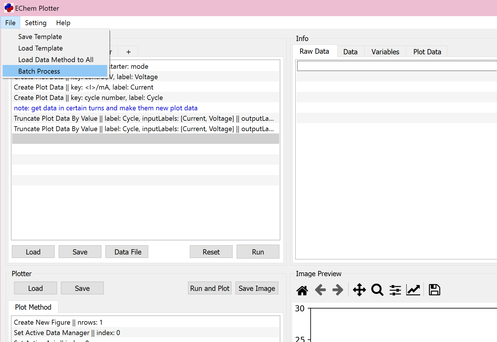

Then, select the data files you want to plot, here we only have two files, but you can choose as many files as you want. Click Open to run.

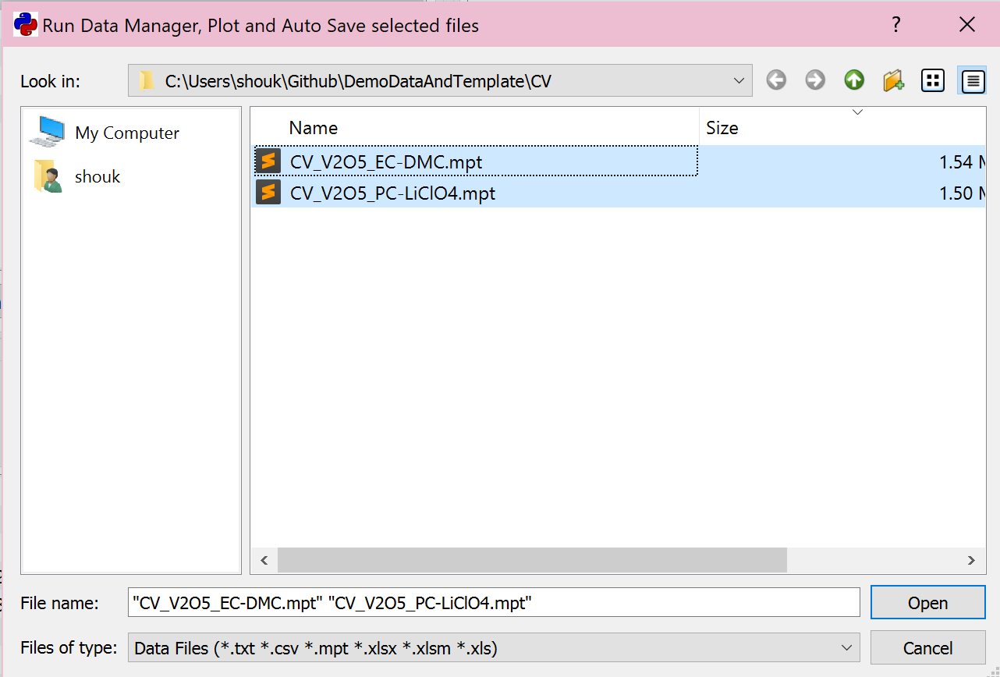

Enter the data file directory. The plots are already there!

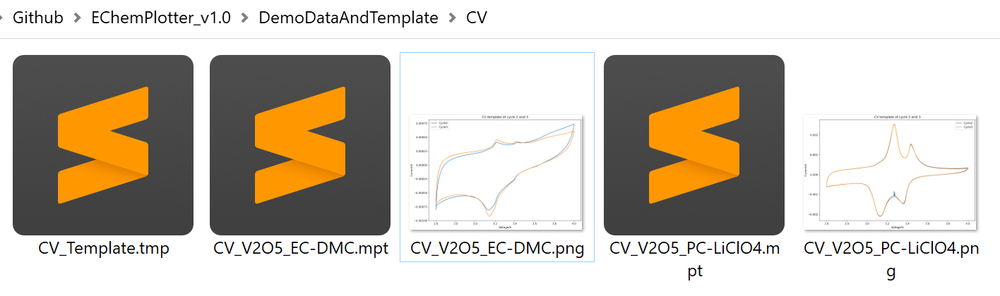
